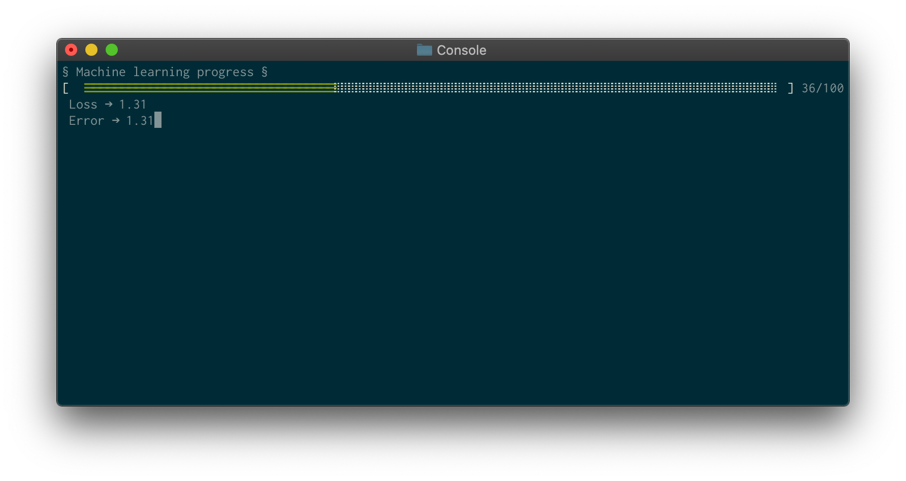

# Demo supervised Machine Learning

## installation

Before installing the modules, you need to make sure that you have the necessary development tools to compile
the native module node in C++.
More information on this link to install it properly: [node-gyp documentation](https://github.com/nodejs/node-gyp#on-macos)

## By the way

This project is a TypeScript redesign of a demo made by Google on their "TensorFlow.JS" framework. You can find more information about this exercise here:

[TensorFlow Exercice](https://codelabs.developers.google.com/codelabs/tfjs-training-regression/index.html#0)
